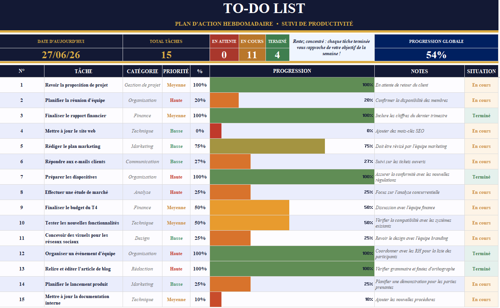

# To-Do List — Dashboard de Productivité Excel

Tableau de suivi de tâches hebdomadaire avec KPIs automatisés, barres de progression dynamiques et mise en forme conditionnelle.

---

## Aperçu

---

## Indicateurs en temps réel

| Total tâches | En attente | En cours | Terminé | Progression globale |
|:---:|:---:|:---:|:---:|:---:|
| **15** | **0** | **11** | **4** | **54 %** |

---

## Structure du tableau

| Colonne | Contenu |
|---------|---------|
| `N°` | Identifiant séquentiel de la tâche |
| `Tâche` | Intitulé de l'action à réaliser |
| `Catégorie` | Domaine d'activité — gestion de projet, finance, marketing, technique... |
| `Priorité` | Haute · Moyenne · Basse |
| `%` | Pourcentage d'avancement, de 0 à 100 |
| `Progression` | Barre de progression colorée selon l'avancement |
| `Notes` | Contexte ou prochaine étape |
| `Situation` | En attente · En cours · Terminé |

---

## Répartition par catégorie

| Catégorie | Tâches |
|-----------|:---:|
| Organisation | 3 |
| Technique | 3 |
| Finance | 2 |
| Marketing | 2 |
| Gestion de projet | 1 |
| Communication | 1 |
| Analyse | 1 |
| Design | 1 |
| Rédaction | 1 |

---

## Fonctionnalités

- Date du jour calculée automatiquement (`AUJOURDHUI()`)
- Comptage dynamique des tâches par statut (`COUNTIF`)
- Progression globale calculée par moyenne pondérée des pourcentages individuels
- Barres de progression avec dégradé rouge → orange → vert selon l'avancement
- Code couleur des statuts dans la colonne Situation
- Vue multi-projets grâce à la catégorisation par domaine

---

## Utilisation

1. Ouvrir `To-Do-List.xlsx` dans Excel ou Google Sheets
2. Ajouter une ligne par nouvelle tâche
3. Renseigner la catégorie, la priorité et le pourcentage d'avancement
4. Les indicateurs en haut du tableau se mettent à jour automatiquement

---

**Emmanuel KOURAOGO**

